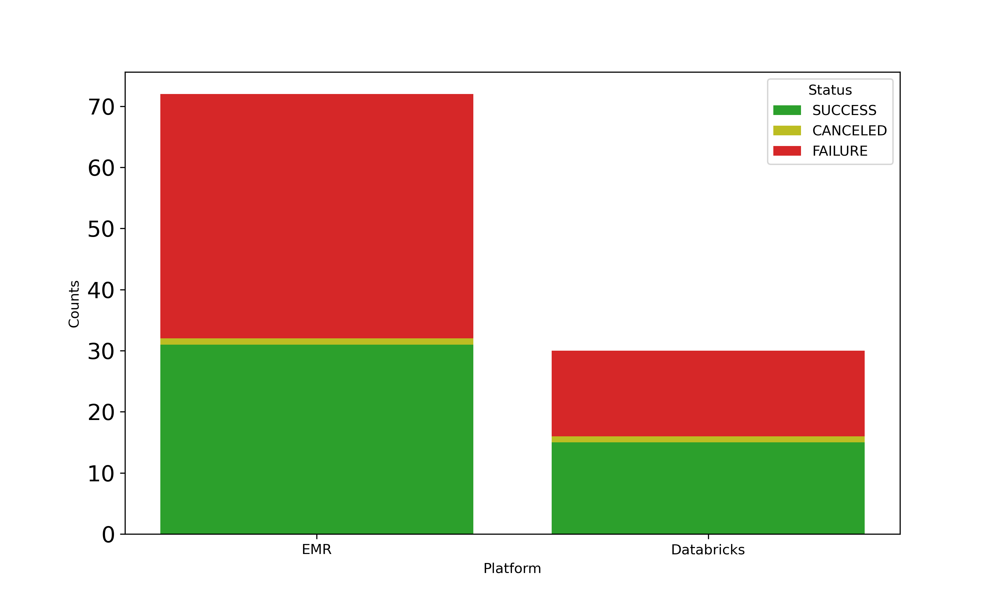
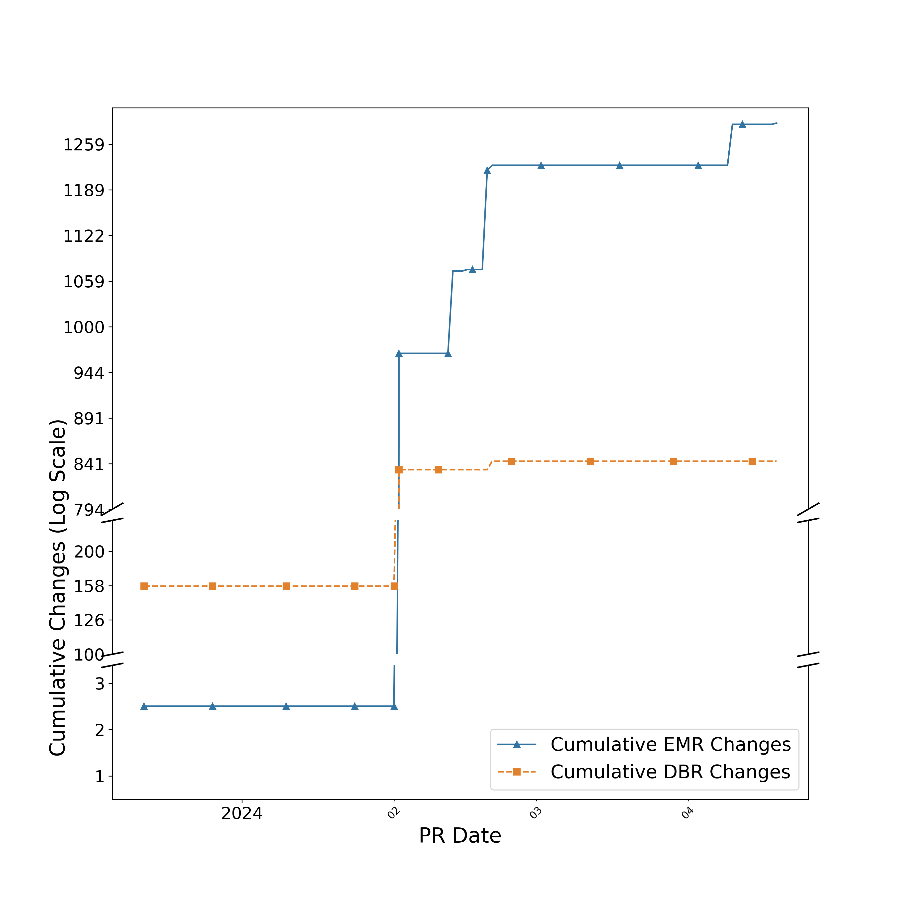

## Implementation Challenges

The implementation of new computational platforms, despite its potential for cost savings and flexibility, is a substantial
operational challenges.
A particular challenge is the transition from DBR to AWS EMR.
Figure @fig:stackedTrial indeed shows a higher failure rate in EMR than in Databricks.
This transition therefore requires constant adjustments and oversight with EMR

{#fig:stackedTrial}

Working with EMR (or any less user-friendly PaaS) demands a steep learning curve.
The initial setup, despite our familiarity with Spark, proved labor-intensive.
The need for nearly double the trial runs for EMR, compared to Databricks, to achieve production stability shows its complex setup and optimization requirements.
We used an iterative process that included:

- Configuring node labeling within YARN to ensure stable core nodes handle critical tasks.
- Maximizing resource allocation, especially when not in fleet mode.
- Addressing EMR’s specific memory management challenges, striking a balance between performance and cost.
- Optimize maintenance tasks, like vacuum operations in Delta Lake. They were automatically handled on Databricks

{#fig:linePlatform}

Configuration insights came from constant refinement, showing the need for an engaged, experimental approach to managing
EMR.
Figure @fig:linePlatform uantitatively depicts this iterative learning process.
These results emphasize the continuous efforts and small improvements necessary to build a robust, cost-efficient platform.

This process also involved fine-tuning YARN’s configurations.
It ensured that critical tasks were allocated to more stable core nodes.
We found that it was critical to enable the `yarn.node-labels.enabled` parameter.
Then, set `yarn.node-labels.am.default-node-label-expression` to `CORE`.
Also, in non-fleet mode, set `maximizeResourceAllocation` to true to use resources efficiently.

Understanding EMR’s specific memory management challenges therefore turned out to be essential.
Doubling memory allocations improved performance and kept costs low.
However, it sometimes led to longer run times than Databricks.
This shows the need to balance cost and performance when using EMR.

To fix slow operations, especially Delta Lake vacuum tasks, it was key to enable parallel deletion by setting `spark.databricks.delta.vacuum.parallelDelete.enabled`
to true.
This optimization was crucial for efficient maintenance.
Databricks handled this automatically while EMR required experimentation to find the right parameter.

Our custom enhancements were designed to integrate with our existing infrastructure.
They include the Dagster Context
Injector, Message Reader, and Cloud Client Innovations.
They offer solutions not met by generic open-source Dagster implementations.
Our aim is therefore to contribute to the community to address such issues wherever we can.
Some changes will stay separate from the Dagster repo to preserve their specialized functions.
Our architecture prioritizes using Dagster to build data processing environments.
This lets us leverage its core features while enhancing them with custom solutions.