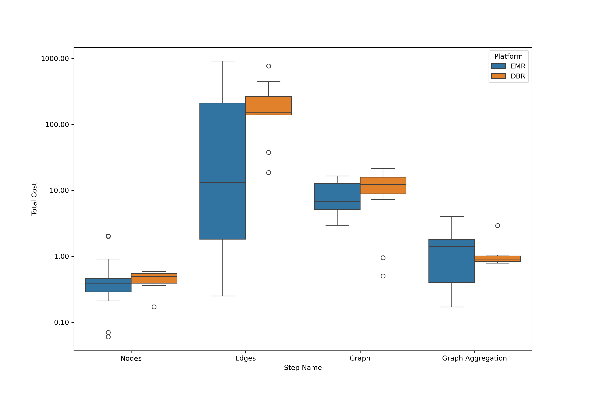
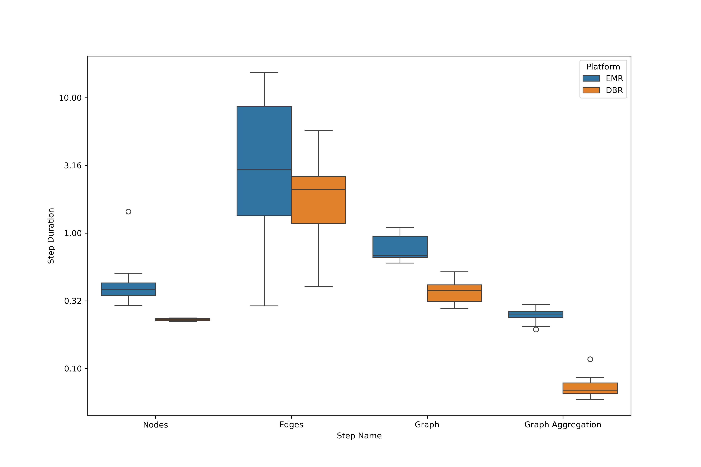

## Platform Comparison

Table [@tab:costTable] shows the computational costs for processing the same Common Crawl data batch on EMR and DBR.
DBR outperforms other options, especially in compute-heavy tasks like edge processing.
But it is much more expensive.
This advantage cuts operational and development time.
It may justify the premium for time-sensitive projects.
EMR, on the other hand, is cheaper.
It suits budget projects that need scalable data processing.

| Run | Step        | Platform | Duration | Total Cost | Platform Surcharge | EBS Cost | EC2 Cost | Aggregated Total Cost | Aggregated Total Surcharge |
|-----|-------------|----------|----------|------------|--------------------|----------|----------|-----------------------|----------------------------|
| 1   | nodes       | EMR      | 0.35     | \$0.40     | \$0.07             | \$0.01   | \$0.32   | \$422.95              | \$90.17                    |
| 1   | edges       | EMR      | 9.99     | \$402.54   | \$80.19            | \$13.72  | \$308.63 |                       |                            |
| 1   | graph       | DBR      | 0.38     | \$18.30    | \$9.78             | \$0.08   | \$8.44   |                       |                            |
| 1   | graph\_aggr | EMR      | 0.27     | \$1.71     | \$0.13             | \$0.02   | \$1.56   |                       |                            |
| 2   | nodes       | DBR      | 0.23     | \$0.50     | \$0.13             | \$0.00   | \$0.37   | \$784.64              | \$252.74                   |
| 2   | edges       | DBR      | 5.71     | \$766.17   | \$240.79           | \$22.47  | \$502.91 |                       |                            |
| 2   | graph       | DBR      | 0.38     | \$17.04    | \$11.61            | \$0.26   | \$5.17   |                       |                            |
| 2   | graph\_aggr | DBR      | 0.11     | \$0.93     | \$0.21             | \$0.00   | \$0.72   |                       |                            |
| 3   | nodes       | EMR      | 0.43     | \$0.42     | \$0.06             | \$0.00   | \$0.36   | \$417.06              | \$83.37                    |
| 3   | edges       | EMR      | 10.49    | \$409.03   | \$82.19            | \$13.82  | \$313.02 |                       |                            |
| 3   | graph       | EMR      | 0.94     | \$4.71     | \$1.05             | \$0.07   | \$3.59   |                       |                            |
| 3   | graph\_aggr | EMR      | 0.23     | \$2.90     | \$0.07             | \$0.00   | \$2.83   |                       |                            |

*Table: Overview of Computational Costs Across Pipeline Configurations.{#tab:costTable}*

{#fig:costProduction}

Figure [@fig:costProduction] shows costs across multiple Common Crawl batches whereas [@fig:durationProduction] compares step durations.
Taken together, these results visualize the trade-off between platforms for different tasks.
DBR had the fastest times due to its optimized runtime.
It uses an optimized Spark version and a C-based rewrite (Photon).
DBR’s pre-configured settings improve usability and efficiency.
They eliminate the need for extensive manual tuning required with EMR.
This further underscores DBR’s cost-effectiveness in resource and time savings.

{#fig:durationProduction}
