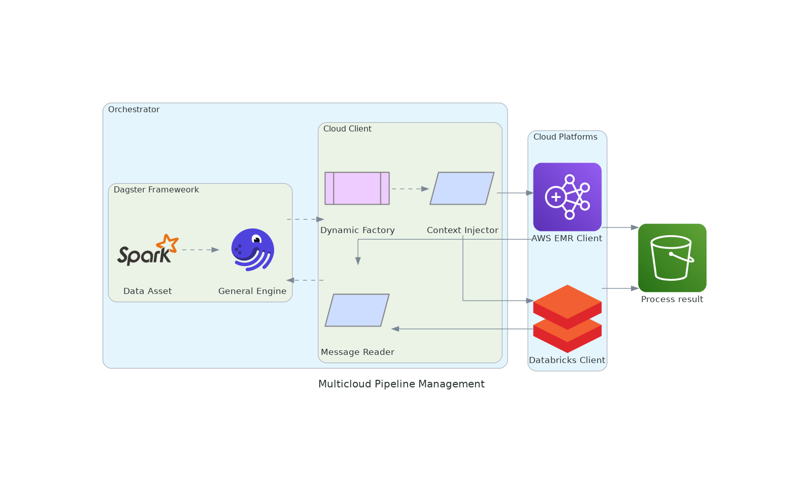
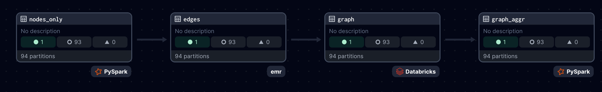

## Summary

The rapid evolution of big data has amplified the need for robust and efficient data processing.
Spark-based Platform-as-a-Service (PaaS) options, like Databricks and Amazon EMR, offer strong analytics.
But at the cost of high operational expenses and vendor lock-in [@kumar].
Despite being user-friendly, their cost structures and opaque pricing can lead to inefficiencies.

This paper introduces a cost-effective, flexible orchestration framework leveraging Dagster [@dagster].
Our solution reduces reliance on a single PaaS provider.
It does this by integrating multiple Spark environments.
We showcase Dagster's power to boost efficiency.
It enforces coding best practices and reduce costs.
Our implementation showed a 12% speedup over EMR.
It cut costs by 40% compared to DBR, saving over 300 euros per pipeline run.
Our framework supports rapid prototyping and testing.
This is key for continuous development and efficiency.
It promotes a sustainable model for large-scale data processing.

## Statement of Need and Relevance

In large-scale data processing, Spark-based PaaS like Databricks are user-friendly and powerful.
But, they have vendor lock-in and unpredictable costs [@Zaharia].
This convenience can lead to inefficient resource use, impacting productivity and increasing expenses.

Our solution uses Dagster's orchestration to integrate diverse Spark environments.
This reduces reliance on a single provider.
This mitigates lock-in risks, cuts costs, and promotes best coding practices.
This boosts productivity by rapidly prototyping on smaller datasets.
It cuts costs by optimizing resource use, without sacrificing performance.
This approach is vital for organizations seeking agile, scalable, and cost-effective data operations.

Also, this approach ensures consistency across development stages.
It helps verify and replicate results, which is critical in scientific research.
Using a tool like Dagster, researchers can create better workflows.
It will foster a collaborative scientific environment.
Their methods will be as open as their findings.

While data pipeline research is growing, existing works focus on different aspects.
Anil et al. [@Anil] emphasize optimizing big data processing.
Use energy-efficient scheduling to reduce consumption and latency in data centers.
Daw et al. [@Daw] explore using predictive analytics to automate resource scaling in cloud environments.
This aims to optimize cost and performance.
Our multi-cloud strategy leverages open orchestration tools like Dagster.
This approach bridges existing gaps, deftly managing data tasks across diverse PaaS.

## Relevance

The proposed framework improves reproducibility by centralizing metadata management and standardizing orchestration across diverse environments.
This in turn reduces infrastructure complexity and aids in consistently replicating experiments, supporting
reliable research.
Notwithstanding the mounting interest in data pipelines, authors such as Mathew et al. (2024) concentrate on the optimisation of big data processing through sophisticated scheduling techniques that minimise energy consumption and latency.
While their work also aims to optimise resource utilisation in data centres, its core emphasis is on the algorithmic enhancement of scheduling mechanisms, rather than on orchestration across different PaaS solutions or on the promotion of coding practices within data pipelines.
In their 2021 paper, @Daw examine the creation of a framework for automated scaling of resources in cloud environments.
Their work focuses on aspects of resource allocation based on predictive analytics, with the goal of optimising operational costs and performance.
In contrast to the work presented here, these approaches do not address the integration of multiple cloud platforms or the orchestration of data processing tasks using open tools.

## Architecture Model

We use Dagster, an open-source data orchestrator, in our framework.
It builds, operates, and monitors data pipelines next to aligning with our cost and performance optimizations.
That this pipeline can also significantly reduce resource use has been previously reported, see @Heiler:

More specifically, we aimed to create a cloud-based management system offering

- Dynamic resource deployment with automatic scaling
- Virtual machine and network configuration management
- Comprehensive deployment and execution monitoring

To achieve these capabilities, several modifications to Dagster default clients were necessary.

Our framework's core components, depicted in Figure \ref{fig:diagram}, include:

1. **Dagster Context Injector:** It manages general and job-specific settings.
They are vital for efficient resource use and task segmentation.

2. **Message Reader Improvements:** It boosts telemetry support.
It captures and processes messages for real-time monitoring and debugging.

3. **Cloud Client Innovations:** Introduces a generic cloud client for managing Dagster on various platforms, ensuring seamless AWS integration and secure environment customization.

4. **Automation and Integration:** Automates job definition uploads with the Databricks REST API and Boto3 clients. It streamlines setup and environment bootstrapping.

5. **Dynamic Factory for Cloud Client Management:** It picks the best execution environments based on changing needs or preferences.

These changes aim at creating a user-friendly interface that shields users from the complexities of cloud resource management.
This shielding significantly reduces overhead and lets organizations focus on strategic goals.
To minimize inconsistencies and configuration issues, we further dockerized the implementation to ensure a controlled development and production environment, facilitating reliability and replicability in production.

### Example Use Case: Mining web-based interfirm networks from Common Crawl

We show our framework by making a web-based map of company ecosystems, as [@kinne].
The research aim in such works is to find relationships between companies.
To this end company websites are searched for hyperlinks to other company websites, often revealing collaborative innovation efforts.

#### Datasets

- Common Crawl CC-MAIN:
This dataset comprises WARC (Web ARChive) files containing raw web crawl data, and WAT files storing computed metadata.
- Seed Nodes:
A subset of URLs (e.g., langing pages of company websites) identified as starting points for our analysis.
These nodes are processed to ensure they are relevant and free of common problems.

#### Pipeline Breakdown

Existing data extraction methods only work on text or graph data.
However, to understand which kind of collaborations companies are forming, our use case requires the extraction of both text and graph data simultaneously.
We therefore developed a custom data extraction method as follows.
Our pipeline consists of four key assets:

1. **NodesOnly**:  Extracts and preprocesses seed node information.
2. **Edges**: Extracts HTML content and hyperlinks from seed node URLs
3. **Graph**: Constructs a hyperlink graph by combining nodes and edges
4. **GraphAggr**: Aggregates the graph to the domain level for broader analysis

Figure \ref{fig:pipleineDagster} hows assets that prove our framework’s adaptability and efficiency.
The framework can handle diverse computing needs across various platforms.
Data partitioning occurs along two dimensions:
time and domain.
The temporal partitioning matches the Common Craw[^1] dataset.
It streamlines data management and access.
Domain-based partitioning, on the other hand, enables parallel processing of different research queries.
This approach allows varied filtering in data analysis.
It optimizes resources and enables task submission to the best platforms.

[^1]: Common Crawl was accessed between October 2023 and March 2024 from [Common Crawl](https://registry.opendata.aws/commoncrawl).

### Further Details

For detailed information on the implementation challenges encountered during the development of our framework, please refer to [Appendix 1](appendix_1.md).

For a comprehensive comparison of the platforms used in our study, please refer to [Appendix 2](appendix_2.md).

## Acknowledgments

This research was supported by [Supply Chain Intelligence Institute Austria (ASCII)](https://ascii.ac.at/).

## References
