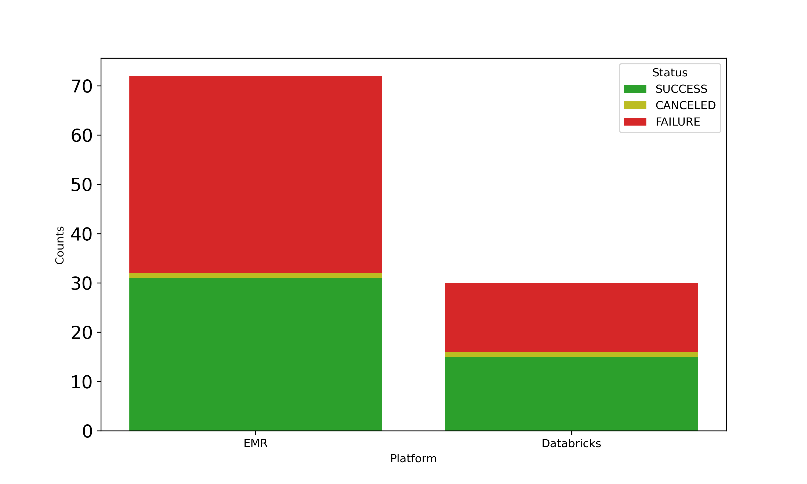
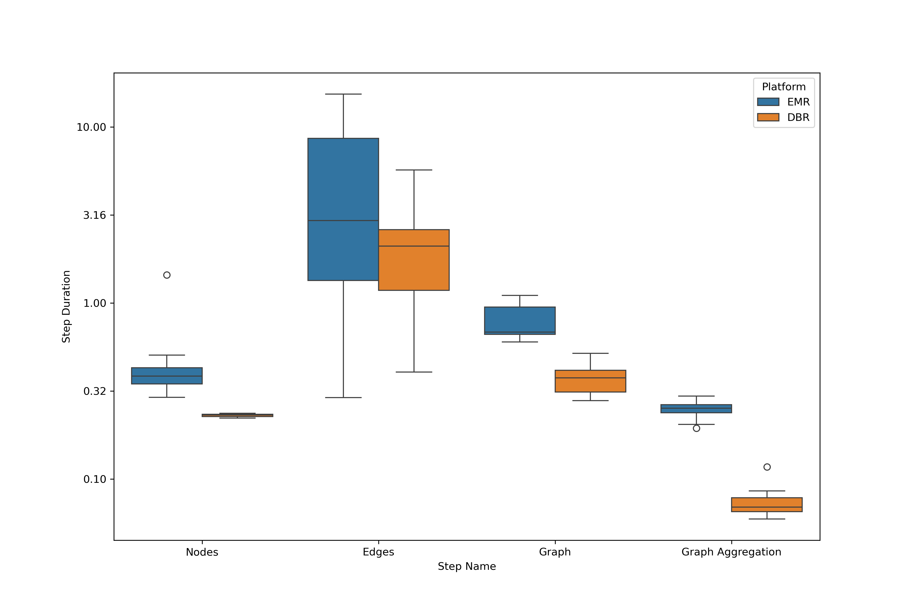

## Summary

The rapid growth of big data has increased the demand for efficient processing.
Spark-based Platform-as-a-Service (PaaS) options like Databricks (DBR) and Amazon Web Services Elastic MapReduce (EMR) offer powerful analytics but come with high operational costs and vendor lock-in [@kumar].
These platforms are user-friendly, yet their pricing models often lead to inefficiencies.
This paper introduces a cost-effective orchestration framework leveraging Dagster [@dagster] to reduce dependency on a single PaaS provider by integrating multiple Spark environments.
Our solution enhances efficiency, enforces best practices, and cuts costs.
We achieved a 12% speedup on EMR and reduced costs by 40% compared to DBR, saving over 300 euros per pipeline run.
This framework supports rapid prototyping while facilitating continuous development and large-scale data processing.

## Statement of Need

Spark-based PaaS platforms like Databricks are convenient but are known to cause vendor lock-in and unpredictable costs [@Zaharia].
This leads to inefficiencies and higher expenses.
Our solution uses Dagster to integrate various Spark environments.
This reduces reliance on a single provide, cuts costs by optimizing resource use, maintains performance and enables agile, scalable data operations.
Furthermore, the solution ensures consistency across development stages which in turn allows for the replication of scientific experiments under identical conditions.
This is key for verifiable research.

Our work addresses research gaps with respect to cloud computing.
Previous work such as [@Anil] focused on energy-efficient scheduling, while [@Daw] explored predictive analytics for cloud resource scaling.
Our approach seeks to bridge such approaches by using a multi-cloud strategy with open orchestration tools like Dagster

## Relevance

The proposed framework improves reproducibility by centralizing metadata management and standardizing orchestration across diverse environments.
This in turn reduces infrastructure complexity and aids in consistently replicating experiments, supporting
reliable research.
Notwithstanding the mounting interest in data pipelines, authors such as Mathew et al. (2024) concentrate on the optimisation of big data processing through sophisticated scheduling techniques that minimise energy consumption and latency.
While their work also aims to optimise resource utilisation in data centres, its core emphasis is on the algorithmic enhancement of scheduling mechanisms, rather than on orchestration across different PaaS solutions or on the promotion of coding practices within data pipelines.
In their 2021 paper, @Daw examine the creation of a framework for automated scaling of resources in cloud environments.
Their work focuses on aspects of resource allocation based on predictive analytics, with the goal of optimising operational costs and performance.
In contrast to the work presented here, these approaches do not address the integration of multiple cloud platforms or the orchestration of data processing tasks using open tools.

## Architecture Model

We use Dagster, an open-source data orchestrator, in our framework.
It builds, operates, and monitors data pipelines next to aligning with our cost and performance optimizations.
That this pipeline can also significantly reduce resource use has been previously reported, see @Heiler:

More specifically, we aimed to create a cloud-based management system offering

- Dynamic resource deployment with automatic scaling
- Virtual machine and network configuration management
- Comprehensive deployment and execution monitoring

To achieve these capabilities, several modifications to Dagster default clients were necessary.

Our framework's core components, depicted in Figure \ref{fig:diagram}, include:

1. **Dagster Context Injector:** It manages general and job-specific settings.
They are vital for efficient resource use and task segmentation.

2. **Message Reader Improvements:** It boosts telemetry support.
It captures and processes messages for real-time monitoring and debugging.

3. **Cloud Client Innovations:** Introduces a generic cloud client for managing Dagster on various platforms, ensuring seamless AWS integration and secure environment customization.

4. **Automation and Integration:** Automates job definition uploads with the Databricks REST API and Boto3 clients. It streamlines setup and environment bootstrapping.

5. **Dynamic Factory for Cloud Client Management:** It picks the best execution environments based on changing needs or preferences.

These changes aim at creating a user-friendly interface that shields users from the complexities of cloud resource management.
This shielding significantly reduces overhead and lets organizations focus on strategic goals.
To minimize inconsistencies and configuration issues, we further dockerized the implementation to ensure a controlled development and production environment, facilitating reliability and replicability in production.

### Example Use Case: Mining web-based interfirm networks from Common Crawl

We show our framework by making a web-based map of company ecosystems, as [@kinne].
The research aim in such works is to find relationships between companies.
To this end company websites are searched for hyperlinks to other company websites, often revealing collaborative innovation efforts.

#### Datasets

- Common Crawl CC-MAIN:
This dataset comprises WARC (Web ARChive) files containing raw web crawl data, and WAT files storing computed metadata.
- Seed Nodes:
A subset of URLs (e.g., langing pages of company websites) identified as starting points for our analysis.
These nodes are processed to ensure they are relevant and free of common problems.

#### Pipeline Breakdown

Existing data extraction methods only work on text or graph data.
However, to understand which kind of collaborations companies are forming, our use case requires the extraction of both text and graph data simultaneously.
We therefore developed a custom data extraction method as follows.
Our pipeline consists of four key assets:

1. **NodesOnly**:  Extracts and preprocesses seed node information.
2. **Edges**: Extracts HTML content and hyperlinks from seed node URLs
3. **Graph**: Constructs a hyperlink graph by combining nodes and edges
4. **GraphAggr**: Aggregates the graph to the domain level for broader analysis

Figure \ref{fig:pipleineDagster} hows assets that prove our framework’s adaptability and efficiency.
The framework can handle diverse computing needs across various platforms.
Data partitioning occurs along two dimensions:
time and domain.
The temporal partitioning matches the Common Craw[^1] dataset.
It streamlines data management and access.
Domain-based partitioning, on the other hand, enables parallel processing of different research queries.
This approach allows varied filtering in data analysis.
It optimizes resources and enables task submission to the best platforms.

[^1]: Common Crawl was accessed between October 2023 and March 2024 from [Common Crawl](https://registry.opendata.aws/commoncrawl).

## Implementation Challenges

The implementation of new computational platforms, despite its potential for cost savings and flexibility, is a substantial
operational challenges.
A particular challenge is the transition from DBR to AWS EMR.
Figure  \ref{fig:stackedTrial} indeed shows a higher failure rate in EMR than in Databricks.
This transition therefore requires constant adjustments and oversight with EMR

Working with EMR (or any less user-friendly PaaS) demands a steep learning curve.
The initial setup, despite our familiarity with Spark, proved labor-intensive.
The need for nearly double the trial runs for EMR, compared to Databricks, to achieve production stability shows its complex setup and optimization requirements.
We used an iterative process that included:

- Configuring node labeling within YARN to ensure stable core nodes handle critical tasks.
- Maximizing resource allocation, especially when not in fleet mode.
- Addressing EMR’s specific memory management challenges, striking a balance between performance and cost.
- Optimize maintenance tasks, like vacuum operations in Delta Lake. They were automatically handled on Databricks

Configuration insights came from constant refinement, showing the need for an engaged, experimental approach to managing
EMR.
Figure \ref{fig:linePlatform} uantitatively depicts this iterative learning process.
These results emphasize the continuous efforts and small improvements necessary to build a robust, cost-efficient platform.

This process also involved fine-tuning YARN’s configurations.
It ensured that critical tasks were allocated to more stable core nodes.
We found that it was critical to enable the `yarn.node-labels.enabled` parameter.
Then, set `yarn.node-labels.am.default-node-label-expression` to `CORE`.
Also, in non-fleet mode, set `maximizeResourceAllocation` to true to use resources efficiently.

Understanding EMR’s specific memory management challenges therefore turned out to be essential.
Doubling memory allocations improved performance and kept costs low.
However, it sometimes led to longer run times than Databricks.
This shows the need to balance cost and performance when using EMR.

To fix slow operations, especially Delta Lake vacuum tasks, it was key to enable parallel deletion by setting `spark.databricks.delta.vacuum.parallelDelete.enabled`
to true.
This optimization was crucial for efficient maintenance.
Databricks handled this automatically while EMR required experimentation to find the right parameter.

Our custom enhancements were designed to integrate with our existing infrastructure.
They include the Dagster Context
Injector, Message Reader, and Cloud Client Innovations.
They offer solutions not met by generic open-source Dagster implementations.
Our aim is therefore to contribute to the community to address such issues wherever we can.
Some changes will stay separate from the Dagster repo to preserve their specialized functions.
Our architecture prioritizes using Dagster to build data processing environments.
This lets us leverage its core features while enhancing them with custom solutions.

## Platform Comparison

Table \ref{tab:costTable} shows the computational costs for processing the same Common Crawl data batch on EMR and DBR.
DBR outperforms other options, especially in compute-heavy tasks like edge processing.
But it is much more expensive.
This advantage cuts operational and development time.
It may justify the premium for time-sensitive projects.
EMR, on the other hand, is cheaper.
It suits budget projects that need scalable data processing.

\begin{landscape}
\begin{table}[]
\begin{tabular}{llllllllll}
\hline
Run & Step        & Platform & Duration & Total Cost & Platform Surcharge & EBS Cost & EC2 Cost & Aggregated Total Cost & Aggregated Total Surcharge \\ \hline
1   & nodes       & EMR      & 0.35     & \$0.40     & \$0.07             & \$0.01   & \$0.32   & \$422.95              & \$90.17                    \\
1   & edges       & EMR      & 9.99     & \$402.54   & \$80.19            & \$13.72  & \$308.63 &                       &                            \\
1   & graph       & DBR      & 0.38     & \$18.30    & \$9.78             & \$0.08   & \$8.44   &                       &                            \\
1   & graph\_aggr & EMR      & 0.27     & \$1.71     & \$0.13             & \$0.02   & \$1.56   &                       &                            \\ \hline
2   & nodes       & DBR      & 0.23     & \$0.50     & \$0.13             & \$0.00   & \$0.37   & \$784.64              & \$252.74                   \\
2   & edges       & DBR      & 5.71     & \$766.17   & \$240.79           & \$22.47  & \$502.91 &                       &                            \\
2   & graph       & DBR      & 0.38     & \$17.04    & \$11.61            & \$0.26   & \$5.17   &                       &                            \\
2   & graph\_aggr & DBR      & 0.11     & \$0.93     & \$0.21             & \$0.00   & \$0.72   &                       &                            \\ \hline
3   & nodes       & EMR      & 0.43     & \$0.42     & \$0.06             & \$0.00   & \$0.36   & \$417.06              & \$83.37                    \\
3   & edges       & EMR      & 10.49    & \$409.03   & \$82.19            & \$13.82  & \$313.02 &                       &                            \\
3   & graph       & EMR      & 0.94     & \$4.71     & \$1.05             & \$0.07   & \$3.59   &                       &                            \\
3   & graph\_aggr & EMR      & 0.23     & \$2.90     & \$0.07             & \$0.00   & \$2.83   &                       &                            \\ \hline
\end{tabular}
\caption{Overview of Computational Costs Across Pipeline Configuration.}
\label{tab:costTable}
\end{table}
\end{landscape}

Figure \ref{fig:costProduction} shows costs across multiple Common Crawl batches whereas \ref{fig:durationProduction} compares step durations.
Taken together, these results visualize the trade-off between platforms for different tasks.
DBR had the fastest times due to its optimized runtime.
It uses an optimized Spark version and a C-based rewrite (Photon).
DBR’s pre-configured settings improve usability and efficiency.
They eliminate the need for extensive manual tuning required with EMR.
This further underscores DBR’s cost-effectiveness in resource and time savings.

## Acknowledgments

This research was supported by [Supply Chain Intelligence Institute Austria (ASCII)](https://ascii.ac.at/).

## References
